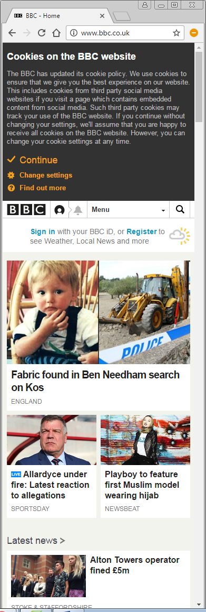

#Responsive Design - Session 1

#Responsive and Desktop Comparison sites

BBC Desktop layout


BBC Responsive layout



 
[link to google] (http://wwwdaringfireball.net/projects/markdown/))

>> Differences / changes Desktop to Responsive


 - Menu symbol added for Responisve site, text minimalised
 - Responsive typography
 - break points - images re-sized
 
<sub> some small text </sub>


Netflix Desktop layout  ![netflix] (netflix2.png) 


Netflix Responsive layout   


Desktop layout  ![starbucks]  (starbucks1.png)


Responsive layout   ![starbucks]  (starbucks-2.png)


``` html

<h1> html code block </h1>


<sub> .. Fig 1 </sub>
```
